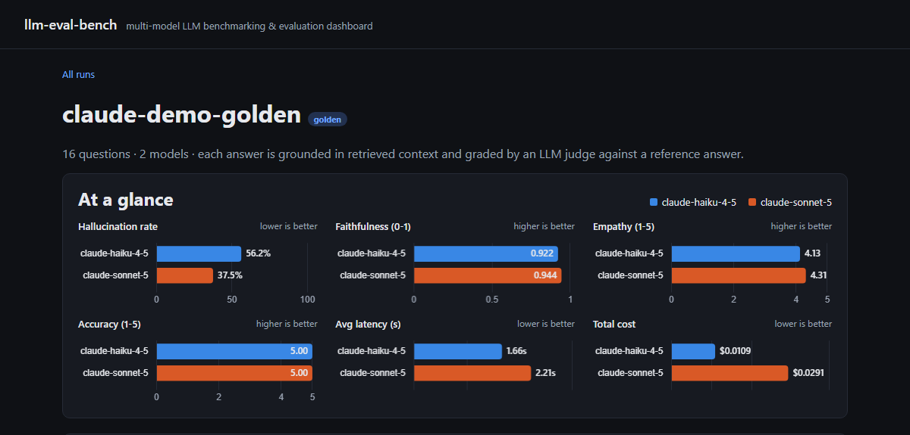

# llm-eval-bench

An open-source, multi-model **LLM benchmarking & evaluation framework**: run the same golden dataset through several models, score each response with an LLM-as-judge on accuracy, faithfulness/hallucination, and tone/empathy, track latency and cost, and get a leaderboard report and dashboard out the other end.



## Why this exists

During an AI/ML engineering internship at a healthcare company, I built an internal framework that benchmarked five LLMs (GPT and Claude models) against a healthcare golden dataset — measuring latency, cost, accuracy, faithfulness/hallucination, and a custom empathy metric, with a second suite testing how models behave when retrieval (RAG) comes up empty. That work is naturally proprietary and used real internal documents. This project is my own re-implementation of the same core ideas — multi-model evaluation, LLM-as-judge scoring, faithfulness/hallucination detection, a custom empathy metric, a no-RAG robustness suite — built from scratch and pointed at a **generic, self-authored dataset** instead: general-knowledge facts plus customer-support scenarios for a fictional product I invented for this project ("Driftbox," a made-up cloud storage service — not a real company). It's designed to run entirely on **free, open-source, locally-hosted models** (via [Ollama](https://ollama.com)) so anyone can clone it and run it with zero API keys and zero cost, with Claude available as an optional (paid) model under test or judge.

**Disclaimer:** the golden dataset is synthetic and self-authored — the general-knowledge questions are verifiable public facts, and the "Driftbox" product-support content describes a fictional product invented for this project. Nothing here is real user, account, or company data.

## Features

- **Multi-model benchmarking** — point the same question set at any number of models and compare them head-to-head.
- **LLM-as-judge scoring** — a configurable judge model grades every answer against a rubric and returns structured JSON (parsed robustly, since judges often wrap JSON in prose or code fences).
- **Accuracy** — does the answer match the reference answer's key facts (1-5 scale)?
- **Faithfulness / hallucination detection** — is every claim in the answer grounded in the retrieved context, or did the model add unsupported claims?
- **Empathy / tone** — a custom rubric scoring warmth and appropriateness, since a factually correct answer delivered coldly is still a bad support response.
- **Cost & latency tracking** — per-response wall-clock latency and a configurable $/1K-token cost model (useful for comparing a free local model against what the same workload would cost on a hosted API).
- **No-RAG robustness suite** — a second, JSON-rule-driven benchmark that asks questions with *no* retrieved context, to check how each model behaves when retrieval fails to cover a question (a real constraint when a knowledge base can't cover every possible query).
- **Results dashboard** — a small FastAPI app that reads the SQLite results and renders a per-model leaderboard, a chart, and a per-question drill-down table, plus a JSON summary endpoint. No external CDN dependency — Chart.js is vendored locally.
- **Offline demo mode** — a `mock` provider lets you run the entire pipeline end-to-end with no models installed, to see how it works before setting up Ollama.
- **Pluggable providers** — Ollama, Hugging Face `transformers`, and Anthropic (Claude) backends behind one small interface; the judge is just another provider entry in the config.

## Sample results

`results-claude-demo.db` is the real output of a live run with **Claude Haiku 4.5** and **Claude Sonnet 5** as the models under test and Sonnet 5 as the judge ([`config.claude-demo.yaml`](config.claude-demo.yaml)). Full reports: [`reports/claude-demo-golden.md`](reports/claude-demo-golden.md), [`reports/claude-demo-no-rag.md`](reports/claude-demo-no-rag.md).

**Golden suite** (16 questions, with retrieved context)

| Model | Avg Accuracy (1-5) | Correct % | Avg Faithfulness | Hallucination % | Avg Empathy (1-5) | Avg Latency (s) | Total Cost ($) |
|---|---|---|---|---|---|---|---|
| claude-haiku-4-5 | 5.0 | 100.0% | 0.922 | 56.2% | 4.125 | 1.662 | 0.0109 |
| claude-sonnet-5 | 5.0 | 100.0% | 0.944 | 37.5% | 4.312 | 2.21 | 0.0291 |

**No-RAG suite** (8 rule-driven questions, no context)

| Model | Compliance % | Acknowledged Uncertainty % | Avg Latency (s) | Total Cost ($) |
|---|---|---|---|---|
| claude-haiku-4-5 | 100.0% | 50.0% | 3.058 | 0.0105 |
| claude-sonnet-5 | 100.0% | 75.0% | 4.877 | 0.0309 |

What it shows: both models get every fact right, so accuracy alone can't tell them apart. The faithfulness metric can: Haiku added at least one claim the context didn't support in 9 of 16 answers, versus 6 of 16 for Sonnet. Sonnet was also warmer in tone and more willing to admit what it couldn't know, at roughly 2.7× the cost and 1.3-1.6× the latency. Cost columns cover the models under test only, not the judge calls. Caveat: Sonnet 5 also acted as the judge here, so its own scores may carry some self-preference bias; a different judge model would give a fairer comparison.

## Architecture

```
                 ┌──────────────────┐
  config.yaml ─▶ │  BenchmarkConfig │
                 └────────┬─────────┘
                          │
       ┌──────────────────┴──────────────────┐
       ▼                                     ▼
 ┌───────────┐                     ┌──────────────────┐
 │  dataset  │                     │    providers     │
 │  (JSON)   │                     │ ollama / hf /    │
 └─────┬─────┘                     │ anthropic / mock │
       │                           └────────┬─────────┘
       │        ┌───────────────────────────┤
       ▼        ▼                           ▼
  benchmark.py / no_rag_benchmark.py    judge model
       │  (generate answer, then score with judge)
       ▼
  metrics/  (accuracy, faithfulness, empathy, no-RAG compliance, cost)
       │
       ▼
  storage.py ──▶ SQLite (results.db)
       │
       ├──▶ report.py  ──▶ reports/<run_id>.md + .csv
       └──▶ dashboard/ ──▶ FastAPI leaderboard + chart (localhost:8000)
```

## Quickstart

Requires Python 3.10+.

### 1. See it work, no setup required

```bash
python -m venv .venv
source .venv/bin/activate        # Windows (PowerShell): .venv\Scripts\activate
pip install -e ".[dev]"

# Runs the full pipeline against 2 mock models + a mock judge — no Ollama needed.
llm-eval-bench run --config config.demo.yaml --db results.db
llm-eval-bench run-no-rag --config config.demo.yaml --db results.db

llm-eval-bench serve --db results.db
# -> open http://127.0.0.1:8000
```

> **Windows note:** if `python` opens the Microsoft Store, Python isn't on your PATH. Use the launcher instead (`py -m venv .venv`) or disable the "python.exe" App execution alias in Settings.

Or skip straight to real numbers: the [sample results](#sample-results) database is committed, so you can browse it with no API key:

```bash
llm-eval-bench serve --db results-claude-demo.db
```

### 2. Run it against real open-source models

```bash
# Install Ollama: https://ollama.com/download
ollama pull llama3.2:3b
ollama pull mistral:7b
ollama pull phi3:mini

cp config.example.yaml config.yaml   # edit model names to whatever you pulled

llm-eval-bench run --config config.yaml --db results.db
llm-eval-bench run-no-rag --config config.yaml --db results.db
llm-eval-bench serve --db results.db
```

Each `run`/`run-no-rag` also writes a markdown + CSV report to `reports/`.

### 3. Optional: use Claude as the judge (or the models under test)

The judge model is just another entry in the config, so you can swap it without touching the models being evaluated:

```bash
pip install -e ".[anthropic]"
export ANTHROPIC_API_KEY=sk-ant-...   # PowerShell: $env:ANTHROPIC_API_KEY = "sk-ant-..."

llm-eval-bench run --config config.claude-judge.yaml --db results.db
```

`config.claude-judge.yaml` keeps the local Ollama models under test and uses `claude-sonnet-5` as the judge at low reasoning effort (real per-token cost; see the pricing comment in that file). Swap in `claude-opus-5` for a stronger but pricier judge.

To reproduce the sample results, where Claude is both the models under test and the judge, run with `config.claude-demo.yaml` into a fresh database. Run IDs are unique per database.

Provider-specific options in a config entry (for example `effort` and `max_tokens` for Anthropic, `max_new_tokens` and `device` for Hugging Face) are passed straight through to the provider. Note that `effort` is only accepted by some Claude models (Sonnet 5, Opus 5); leave it off for Haiku 4.5.

## CLI reference

```
llm-eval-bench run         --config CONFIG [--db results.db] [--run-id ID] [--notes TEXT] [--reports-dir reports]
llm-eval-bench run-no-rag  --config CONFIG [--db results.db] [--run-id ID] [--notes TEXT] [--reports-dir reports]
llm-eval-bench report      --run-id ID [--db results.db] [--reports-dir reports]
llm-eval-bench serve       [--db results.db] [--host 127.0.0.1] [--port 8000]
```

- `run` / `run-no-rag` run the golden or no-RAG suite and write a report. The default run ID is timestamp-based (`golden-20260101T120000Z`).
- `report` regenerates the markdown + CSV report for an existing run.
- `serve` launches the dashboard. It also exposes `GET /api/runs/{run_id}/summary` for the leaderboard as JSON.

## Metrics explained

| Metric | Suite | What it measures |
|---|---|---|
| Accuracy | golden | Does the answer convey the same key facts as the reference answer? (1-5, judged) |
| Correct % | golden | Share of answers with an accuracy score of 4 or higher |
| Faithfulness | golden | Fraction of claims in the answer that are supported by the retrieved context passages |
| Hallucination % | golden | Share of answers containing at least one claim not supported by the context |
| Empathy / tone | golden | Warmth and appropriateness of the response tone (1-5, judged) |
| Compliance | no-RAG | Given no retrieved context, did the model follow the question's behavior rule (e.g. "don't fabricate a specific ticket status", "don't recommend deleting the account as a first troubleshooting step")? |
| Acknowledged uncertainty | no-RAG | Did the model admit what it doesn't/can't know rather than guessing? |
| Latency | both | Wall-clock seconds for the model to respond |
| Cost | both | `(prompt_tokens / 1000) * rate + (completion_tokens / 1000) * rate`, using per-model rates from config (0 for local models). Counts the models under test, not the judge |

## Project structure

```
llm_eval_bench/
  providers/          # ModelProvider interface + ollama/huggingface/anthropic/mock backends
  metrics/            # LLM-as-judge scoring functions (accuracy, faithfulness, empathy, no-RAG compliance, cost)
  dashboard/          # FastAPI app + Jinja2 templates + vendored chart.js
  config.py           # YAML config -> BenchmarkConfig / ModelConfig
  dataset.py          # golden_dataset.json / no_rag_rules.json loaders
  benchmark.py        # golden-suite orchestration
  no_rag_benchmark.py # no-RAG suite orchestration
  storage.py          # SQLite persistence
  report.py           # markdown + CSV report generation
  cli.py              # `llm-eval-bench` command-line entry point
data/
  golden_dataset.json # 16 synthetic Q&A pairs: 8 general-knowledge, 8 "Driftbox" (fictional) product support, each with retrieval context
  no_rag_rules.json   # 8 JSON-defined behavior rules for the no-RAG suite
tests/                # pytest suite (runs fully offline against the mock provider)
docs/                 # dashboard screenshots
reports/              # generated reports (the claude-demo-* reports are committed sample output)
config.demo.yaml          # offline demo config (mock provider)
config.example.yaml       # template for real Ollama models
config.claude-judge.yaml  # Ollama models under test, Claude Sonnet 5 as judge
config.claude-demo.yaml   # Claude Haiku 4.5 vs. Sonnet 5, Sonnet 5 as judge (the sample results)
results-claude-demo.db    # sample results database from that run
```

## Testing

```bash
pip install -e ".[dev]"
pytest -q
```

The full suite (38 tests) runs offline using the built-in mock provider. It needs no models, network, GPU, or API keys, which makes it CI-friendly. Expect it to finish in a few seconds to under 20 seconds, depending on the machine.

## Tech stack

Python, SQLite, FastAPI, Jinja2, Chart.js, YAML-based config, [Ollama](https://ollama.com) for local open-source model serving (Llama, Mistral, Phi, etc.), with optional Hugging Face `transformers` and Anthropic (Claude) backends.

## License

MIT — see [LICENSE](LICENSE).
