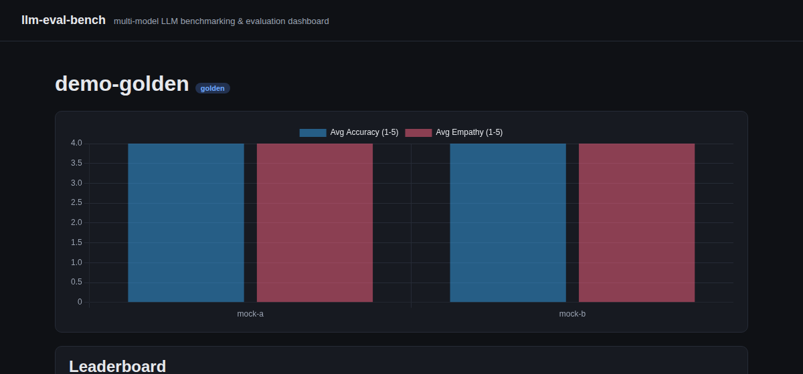

# llm-eval-bench

An open-source, multi-model **LLM benchmarking & evaluation framework**: run the same golden dataset through several models, score each response with an LLM-as-judge on accuracy, faithfulness/hallucination, and tone/empathy, track latency and cost, and get a leaderboard report and dashboard out the other end.



## Why this exists

During an AI/ML engineering internship at a healthcare company, I built an internal framework that benchmarked five LLMs (GPT and Claude models) against a healthcare golden dataset — measuring latency, cost, accuracy, faithfulness/hallucination, and a custom empathy metric, with a second suite testing how models behave when retrieval (RAG) comes up empty. That work is naturally proprietary and used real internal documents. This project is my own re-implementation of the same core ideas — multi-model evaluation, LLM-as-judge scoring, faithfulness/hallucination detection, a custom empathy metric, a no-RAG robustness suite — built from scratch and pointed at a **generic, self-authored dataset** instead: general-knowledge facts plus customer-support scenarios for a fictional product I invented for this project ("Driftbox," a made-up cloud storage service — not a real company). It's designed to run entirely on **free, open-source, locally-hosted models** (via [Ollama](https://ollama.com)) so anyone can clone it and run it with zero API keys and zero cost, with Claude available as an optional, stronger (paid) judge model.

**Disclaimer:** the golden dataset is synthetic and self-authored — the general-knowledge questions are verifiable public facts, and the "Driftbox" product-support content describes a fictional product invented for this project. Nothing here is real user, account, or company data.

## Features

- **Multi-model benchmarking** — point the same question set at any number of models and compare them head-to-head.
- **LLM-as-judge scoring** — a configurable judge model grades every answer against a rubric and returns structured JSON.
- **Accuracy** — does the answer match the reference answer's key facts (1-5 scale)?
- **Faithfulness / hallucination detection** — is every claim in the answer grounded in the retrieved context, or did the model add unsupported claims?
- **Empathy / tone** — a custom rubric scoring warmth and appropriateness, since a factually correct answer delivered coldly is still a bad support response.
- **Cost & latency tracking** — per-response wall-clock latency and a configurable $/1K-token cost model (useful for comparing a free local model against what the same workload would cost on a hosted API).
- **No-RAG robustness suite** — a second, JSON-rule-driven benchmark that asks questions with *no* retrieved context, to check how each model behaves when retrieval fails to cover a question (a real constraint when a knowledge base can't cover every possible query).
- **Results dashboard** — a small FastAPI app that reads the SQLite results and renders a per-model leaderboard, a chart, and a per-question drill-down table. No external CDN dependency — Chart.js is vendored locally.
- **Offline demo mode** — a `mock` provider lets you run the entire pipeline end-to-end with no models installed, to see how it works before setting up Ollama.
- **Pluggable judge model** — the judge is just another provider in the config. Default it to a free local model, or point it at Claude (Sonnet 5 / Opus 5 via the Anthropic API) for a stronger, more consistent grader at real per-token cost — see `config.claude-judge.yaml`.

## Architecture

```
                ┌────────────────┐
 config.yaml ─▶ │  BenchmarkConfig │
                └───────┬─────────┘
                        │
      ┌─────────────────┼──────────────────┐
      ▼                                     ▼
┌───────────┐                       ┌───────────────┐
│  dataset  │                       │   providers    │
│  (JSON)   │                       │ ollama / hf /  │
└─────┬─────┘                       │     mock       │
      │                             └───────┬────────┘
      │        ┌────────────────────────────┤
      ▼        ▼                            ▼
  benchmark.py / no_rag_benchmark.py   judge model
      │  (generate answer, then score with judge)
      ▼
  metrics/  (accuracy, faithfulness, empathy, no-RAG compliance, cost)
      │
      ▼
  storage.py ──▶ SQLite (results.db)
      │
      ├──▶ report.py  ──▶ reports/<run_id>.md + .csv
      └──▶ dashboard/  ──▶ FastAPI leaderboard + chart (localhost:8000)
```

## Quickstart

### 1. See it work, no setup required

```bash
python -m venv .venv && source .venv/bin/activate
pip install -e ".[dev]"

# Runs the full pipeline against 2 mock models + a mock judge — no Ollama needed.
llm-eval-bench run --config config.demo.yaml --db results.db
llm-eval-bench run-no-rag --config config.demo.yaml --db results.db

llm-eval-bench serve --db results.db
# -> open http://127.0.0.1:8000
```

Or skip straight to real numbers: `results-claude-demo.db` in this repo is the actual output of a live
Claude Haiku 4.5 vs. Sonnet 5 run (see `reports/claude-demo-golden.md` / `claude-demo-no-rag.md` for the
plain-text summary). No API key needed to view it:

```bash
llm-eval-bench serve --db results-claude-demo.db
```

### 2. Run it against real open-source models

```bash
# Install Ollama: https://ollama.com/download
ollama pull llama3.2:3b
ollama pull mistral:7b
ollama pull phi3:mini

cp config.example.yaml config.yaml   # edit model names to whatever you pulled

llm-eval-bench run --config config.yaml --db results.db
llm-eval-bench run-no-rag --config config.yaml --db results.db
llm-eval-bench serve --db results.db
```

Each `run`/`run-no-rag` also writes a markdown + CSV report to `reports/`.

### 3. Optional: use Claude as the judge instead

The judge model is just another entry in the config — swap it out without touching the models being evaluated:

```bash
pip install -e ".[anthropic]"
export ANTHROPIC_API_KEY=sk-ant-...

llm-eval-bench run --config config.claude-judge.yaml --db results.db
```

`config.claude-judge.yaml` defaults to `claude-sonnet-5` at low reasoning effort (real per-token cost — see the pricing comment in that file); swap in `claude-opus-5` for a stronger but pricier judge.

## Metrics explained

| Metric | Suite | What it measures |
|---|---|---|
| Accuracy | golden | Does the answer convey the same key facts as the reference answer? (1-5, judged) |
| Faithfulness | golden | Fraction of claims in the answer that are supported by the retrieved context passages; lists unsupported claims as a hallucination signal |
| Empathy / tone | golden | Warmth and appropriateness of the response tone (1-5, judged) |
| Compliance | no-RAG | Given no retrieved context, did the model follow the question's behavior rule (e.g. "don't fabricate a specific ticket status", "don't recommend deleting the account as a first troubleshooting step")? |
| Acknowledged uncertainty | no-RAG | Did the model admit what it doesn't/can't know rather than guessing? |
| Latency | both | Wall-clock seconds for the model to respond |
| Cost | both | `(prompt_tokens / 1000) * rate + (completion_tokens / 1000) * rate`, using per-model rates from config (0 for local models) |

## Project structure

```
llm_eval_bench/
  providers/        # ModelProvider interface + ollama/huggingface/anthropic/mock backends
  metrics/          # LLM-as-judge scoring functions (accuracy, faithfulness, empathy, no-RAG compliance, cost)
  dashboard/         # FastAPI app + Jinja2 templates + vendored chart.js
  config.py          # YAML config -> BenchmarkConfig / ModelConfig
  dataset.py         # golden_dataset.json / no_rag_rules.json loaders
  benchmark.py        # golden-suite orchestration
  no_rag_benchmark.py # no-RAG suite orchestration
  storage.py          # SQLite persistence
  report.py           # markdown + CSV report generation
  cli.py              # `llm-eval-bench` command-line entry point
data/
  golden_dataset.json   # 16 synthetic Q&A pairs: 8 general-knowledge, 8 "Driftbox" (fictional) product support, each with retrieval context
  no_rag_rules.json      # 8 JSON-defined behavior rules for the no-RAG suite
tests/                   # pytest suite (runs fully offline against the mock provider)
config.demo.yaml          # offline demo config (mock provider)
config.example.yaml       # template for real Ollama models
config.claude-judge.yaml  # same models under test, Claude Sonnet 5 as judge
```

## Testing

```bash
pip install -e ".[dev]"
pytest -q
```

The full suite (38 tests) runs offline in under a second using the built-in mock provider — no models, network, or GPU required, which also makes it CI-friendly.

## Tech stack

Python, SQLite, FastAPI, Jinja2, Chart.js, YAML-based config, [Ollama](https://ollama.com) for local open-source model serving (Llama, Mistral, Phi, etc.), with optional Hugging Face `transformers` and Anthropic (Claude) backends.

## License

MIT — see [LICENSE](LICENSE).
